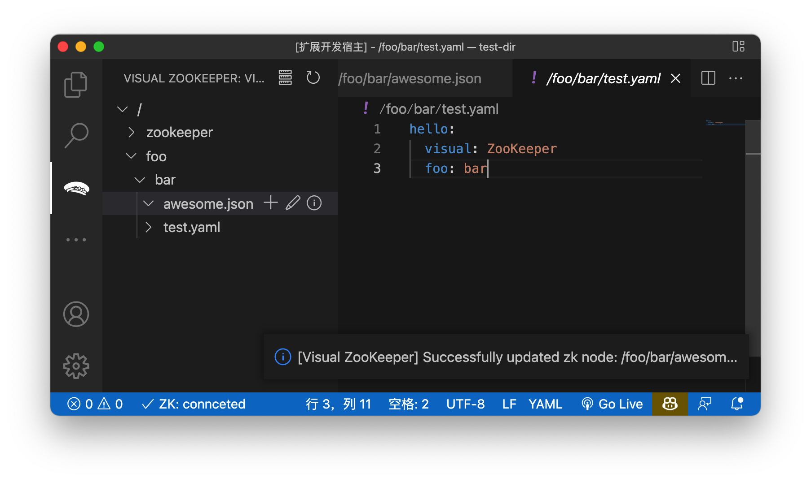

# Visual ZooKeeper

Visually manage your ZooKeeper in Visual Studio Code.

## Features
1. 🚀 Edit and view data on ZooKeeper using the perfect VSCode's editor.

2. 🚀 View node statistics info

3. 🚀 Add nodes directly from the page

4. 🚀 Support Command Palette

## Extension Settings

When using Visual ZooKeeper for the first time, you need to configure the server address of zk, you can click the button or use the command palette to call out the configuration page.

## Known Issues

## Release Notes

### 1.0.0

Initial release of Visual ZooKeeper
